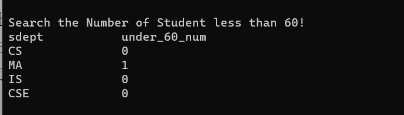
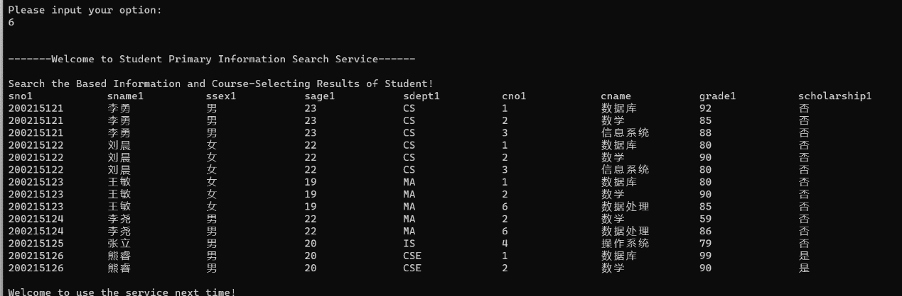

# 数据库设计

## 环境配置和初始化

为了创建一个使用C++中的嵌入式SQL提供数据库查询功能的学生管理系统，可以按照以下步骤操作：

1.  在Visual Studio 2019中新建一个空项目，选择Debug配置和X64平台。
2.  打开项目属性，转到C/C++ \> 常规 \> 附加包含目录。添加下载的MySQL源代码中的include目录。
3.  转到链接器 \> 常规 \> 附加库目录，添加下载的MySQL源代码中的lib目录。
4.  转到链接器 \> 输入 \> 附加依赖项，添加MySQL源代码中的libmysql.lib文件。添加完成后，将libmysql.lib文件拷贝到项目目录下。
5.  使用MySQL C++ API中的mysql_init和mysql_real_connect函数初始化连接句柄并连接到数据库。

在添加了必要的文件之后，就可以使用MySQL C++ API在C++中编写嵌入式SQL代码连接并查询数据库。还可以使用API执行其他操作，例如在数据库中插入、更新和删除数据，关键代码如下图所示。

## 功能实现

### 新生入学信息增加，学生信息修改

### 课程信息维护（增加新课程，修改课程信息，删除没有选课的课程信息）

### 录入学生成绩，修改学生成绩

### 按系统计学生的平均成绩、最好成绩、最差成绩、优秀率、不及格人数；

### 按系对学生成绩进行排名，同时显示出学生、课程和成绩信息

### 输入学号，显示该学生的基本信息和选课信息

