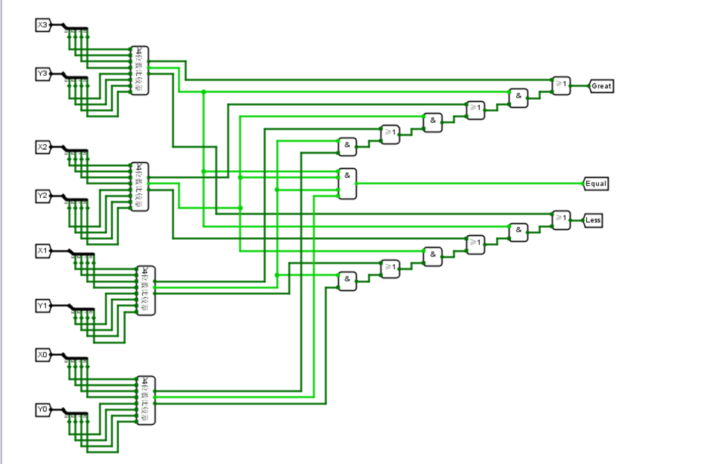
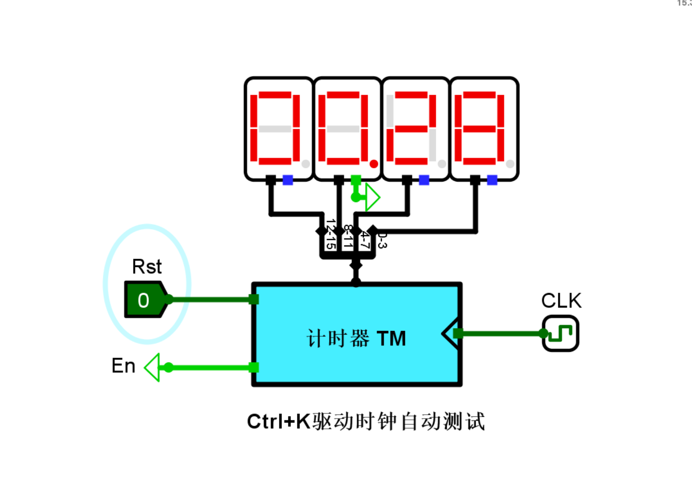
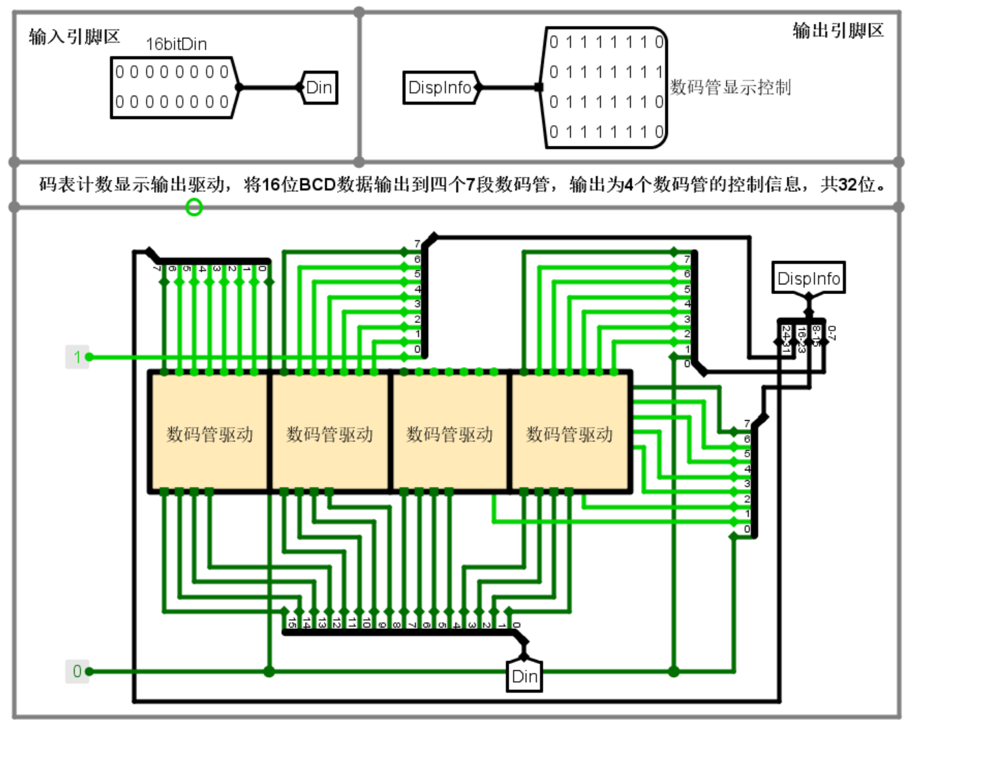
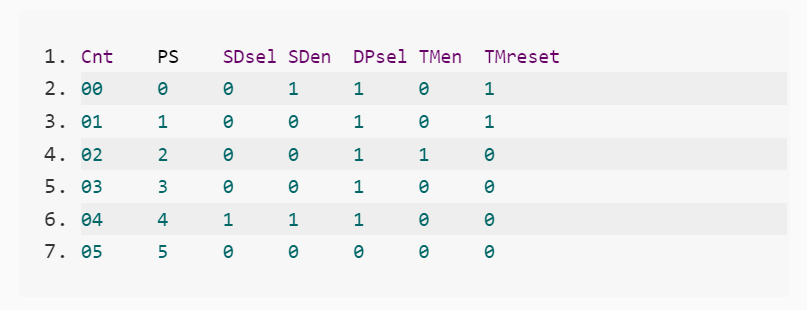
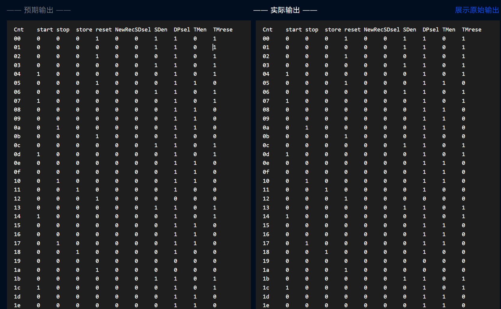

# 数字电路逻辑实验

## 实验环境

软件：Logisim2.15.0.2

平台：https://www.educoder.net/classrooms/11930/shixun_homework

## 实验内容
设计一个运动码表系统，具体内容及要求如下：
输入：4个按钮，分别为Start、Stop、Store和Reset。
输出：4个7段数码管显示数字，分别显示小时和分钟。
具体功能：
(1)当按下Start时，计时器清零，重新开始计时；
(2)当按下Stop时，计时器停止计时，显示计时数据；
(3)当按下Store时，若当前计时数据小于系统记录，则更新系统记录，并显示当前计时数据；否则不更新系统记录，但显示系统记录。
(4)当按下Reset时，复位，计时=0.00, 系统记录=99.99。

## 7段数码管驱动电路设计

### 设计思路及设计过程

设计7段数码管驱动电路首先要弄明白数字显示的每一段对应电路的哪一个引脚，在确定无误后，思考每一个数字对应哪些段需要亮，哪些段不亮，再将对应的引脚设置为1或者0，最后逐个写出真值表。

### 电路图

### 测试图

## 2选1选择器设计（1位，16位）

### 设计思路及设计过程

Sel是选择控制端，输入1，选择X1，输入0，选择X0，所以运用两个与门，一个或门，一个非门，与门的两端，必定会输出一个选择的那一个对应的值和一个0，通过或门实现相加的作用，来输出对应选择的输入。
十六位的原理基本相同，只需要将Sel转化为十六位的二进制数，同时将与门或门的位宽都改成16，可以输入一个选择16位数。

### 电路图

### 测试图

## 无符号比较器设计（16位）

### 设计思路及设计过程

首先实现4位的无符号比较器的设计，四位二进制数的比较按照从高位到低位逐个比较，高位的1大于0，则不用比较，直接输出大于，如果0小于1，直接输出小于，如果等于，再比较低的一位。可以运用输入表达式生成电路的方法来实现4位的无符号比较器设计。
十六位的无符号比较器设计，通过四个4位的无符号比较器来实现，先比较高位，后比较地位的思路基本不变，四个4位的无符号比较器会产生12个输出，我们可以另加一个电路设置12个输入，3个输出，然后通过输入表达式方法设计一个电路，表达式分别是：
> G = A2 B2 C2 D3 + A2 B2 C3 + A2 B3 + A3

> E = A2 B2 C2 D2

> L = A1 + A2 B1 + A2 B2 C1 + A2 B2 C2 D1

再将该电路复制到十六位无符号比较器电路图中，将4个四位无符号比较器的输出分别和该子电路对应的输入连接起来。

### 电路图

### 测试图

## 并行加载寄存器(4位，16位)

### 设计思路及设计过程

设计4位并行加载寄存器，运用四个D触发器，来实现，当使能段为1时，电路的下一次输出是当前的输入。
设计16位并行加载寄存器，运用4个4位并行加载寄存器，将16位的输入利用分线器分成4个4位输入，再以此接入4个4位并行加载寄存器，输出16位。

### 电路图

### 测试图

## BCD计数器设计（含状态机、输出函数和整体电路）

### 设计思路及设计过程

先设计BCD计数器状态转换，要实现次态N等于现态S加上1，可以利用excel表格先穷举所有的情况。

然后会自动生成表达式：

> N3 = \~S3&S2&S1&S0+S3&\~S2&\~S1&\~S0

> N2 = \~S3&\~S2&S1&S0+\~S3&S2&\~S1&\~S0+\~S3&S2&\~S1&S0+\~S3&> S2&S1&\~S0

> N1 = \~S3&\~S2&\~S1&S0+\~S3&\~S2&S1&\~S0+\~S3&S2&\~S1&S0+\~S3&S2&S1&\~S0

> N0=\~S3&\~S2&\~S1&\~S0+\~S3&\~S2&S1&\~S0+\~S3&S2&\~S1&\~S0+\~S3&S2&S1&\~S0+S3&\~S2&\~S1&\~S0

然后再logisim中输入表达式，自动生成BCD计数器状态转化电路图。
再设计BCD计数器输出函数，当输入为1001时，输出进位1。
最后在BCD计数器总电路中，运用4个D触发器，从0开始，4个D触发器输出段和输入段的内容一样，再通过BCD计数器状态转化电路来实现加一功能，再输入到D触发器的输入段，以此往复，可以实现逐步加一的功能，同时4个D触发器的输出连接到BCD输出函数电路，得到是否进位的信号输出。

### 电路图

### 测试图

## 码表计数器设计（4位十进制）

### 设计思路及设计过程

设计4位十进制的码表计数器，需要用到4个BCD计数器，从低位往高位，使能端先接入第一低位的BCD计数器，使能端和第一低位进位输出相与接入第二低位使能端，然后当低位产生进位，第二位也产生进位的时候，第三位才开始计数，第四位也是同样的道理。最后实现4位的10进制数的计数。

### 电路图

### 测试图

## 码表显示驱动设计

### 设计思路及设计过程

在数码管驱动的基础上，将输入的16位数分成4组，每一组用7段的数码管驱动显示表示，得到最后32位的输出。由于第三位后有小数点，所以第三个数码管驱动对应的八位的分线器的0位接上1，其他数码管驱动对应的分线器的0位接上0。

### 电路图

### 测试图

## 码表控制器状态机设计

### 设计思路及设计过程

根据码表控制器状态图，用Excel表格写出状态转化表：

对于N2，N1，N0生成表达式，将表达式写入，自动生成电路：

> N2 = \~start \~reset S2 \~S1 + \~reset S2 \~S1 \~S0 + \~start \~stop store \~reset \~S2 S1 S0

> N1 = \~start \~store \~reset \~S2 S1 + \~stop \~reset \~S2 S1 \~S0 + start \~stop \~store \~reset \~S2 \~S1 S0

> N0 = \~start \~reset \~S1 + \~reset \~S1 \~S0 + \~start \~stop \~reset \~NewRecord \~S2 S0 + \~stop \~store \~reset \~S2 S1 S0 + \~stop \~store \~reset S2 \~S1 + \~start stop \~store \~reset \~S2

### 电路图

### 测试图

## 码表控制器输出函数设计

### 设计思路及设计过程

该电路有三个输入S0，S1，S2，有五个输出，分别位SDsel，SDen，DPsel，TMen，TMreset，它们的作用分别为：

根据真值表:

利用真值表生成电路

### 电路图

### 测试图

## 码表控制器

### 设计思路及设计过程
拥有start，stop，store，reset，NewRecord五个输入，经过已经设计好的状态转化电路，输出对应的次态，再经过三个D触发器实现状态的转化，将三个D触发器的输出接到状态转化电路对应的3个输入中，实现对状态的控制，再将三个D触发器的输入接入码表控制器输出函数电路，实现对相应信号的输出。
### 电路图

### 测试图

## 运动码表

### 设计思路及设计过程
通过输入start，stop，store，reset，输出相应的控制信号，相应的信号控制相应的模块，通过各个模块完成相应的功能，计数器当有时间脉冲时，进行逐步计数，当选择store时，2路选择器和寄存器工作，存储已经输入的值，同时16位无符号比较器负责比较，存储最小的数，并通过二路选择器选择最小的数，进入码表显示模块，显示出来。
### 电路图

### 测试图

