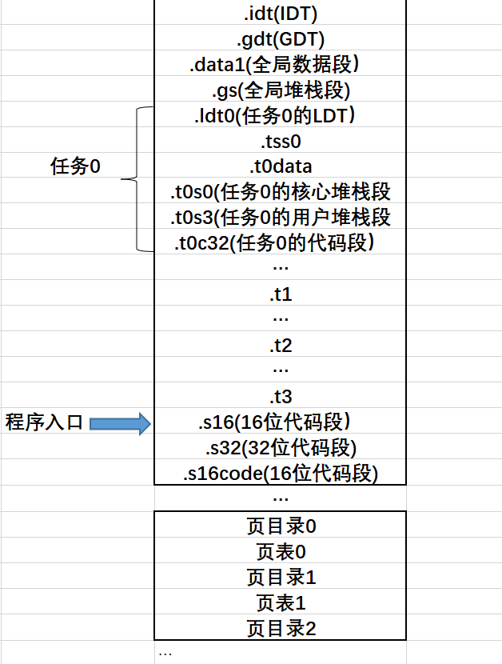
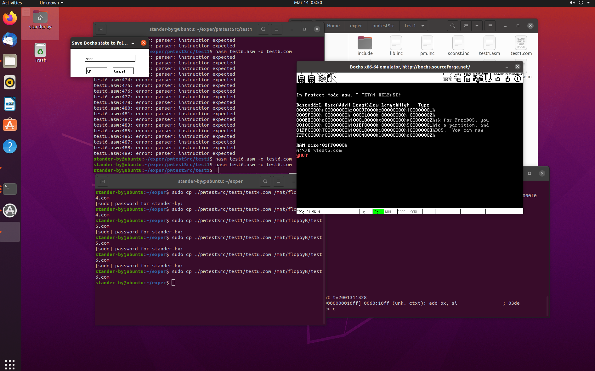
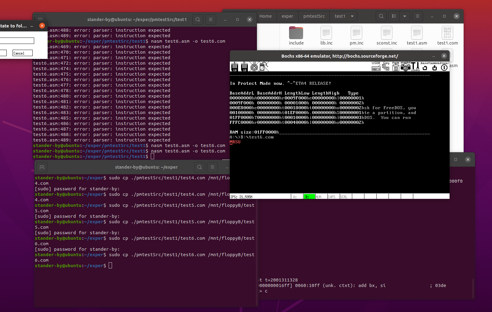
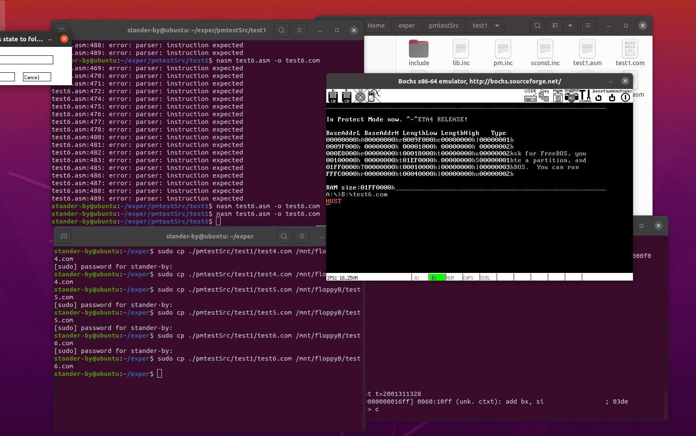
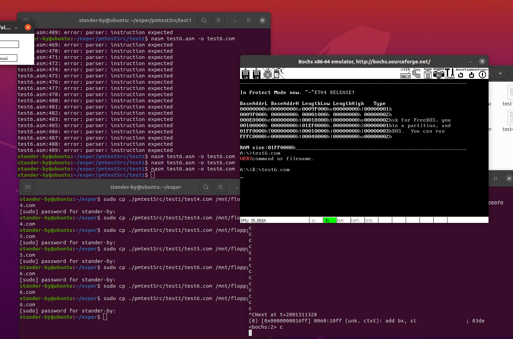

# 在裸机保护模式下实现页机制和优先数调度机制的演示
启动保护模式，建立两个或更多具有不同优先级的任务（每个任务不停循环地在屏幕上输出字符串），所有任务在时钟驱动（时钟周期50ms，可调）下进行切换。任务切换采用“优先数进程调度策略”。
## 实验目的
> - 理解保护模式基本的工作原理，操作系统的运行机制；
> - 理解保护模式下的地址映射，理解物理地址，虚拟地址和线性地址；
> - 理解段和页的机制，理解计算机内存管理的基本原理；
> - 掌握进程切换的具体汇编代码操作，具体调度算法和实现；
> - 掌握保护模式初始化的具体汇编代码操作；
> - 掌握任务的定义和切换，理解GDT，LDT，TSS等概念；
> - 理解保护模式下中断程序，掌握具体汇编代码操作；
## 开发和运行环境的配置
#### Ubuntu20.04
#### Bochs、Nasm、FreeDOS
> - 使用apt-get安装bochs、bochs-x、nasm。
> - 在 Bochs 官方网站下载 FreeDos，解压后将其中的 a.img 复制到工作目录下，并重命名为 freedos.img。
> - 使用 bximage 在工作目录下生成一个软盘映像 b.img。
> - 修改 bochsrc.txt，具体内容见附件。
> - 启动 Bochs，待 FreeDos 启动完成后使用“format b:”命令格式化 B:盘。将 asm 代码指定的起始位置 07c00h 修改为 0100h，并使用 nasm 编译生成.com 可执行文件，之后将.com 可执行文件复制到虚拟软盘 b.img 上，即可在 Bochs 内运行该程序。编译与复制操作集成到了位于工作目录下的脚本文件 mount.sh 中。

至此，就可以在Ubuntu中编译asm文件生成com文件，并挂载到b.img上并在Bochs内运行.com程序。
## 内存分布设计

## 测试
字符串“WHUT”

字符串“MRSU”

字符串“HUST”

字符串“VERY”

