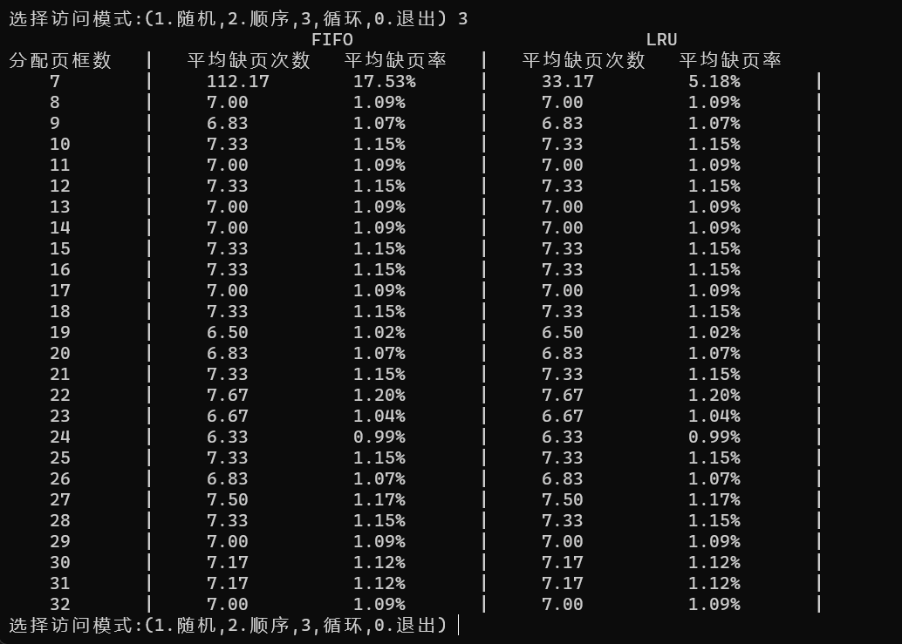

# OS-Experiments
Experiment of OS in HUST-CSE
## linux内核编译
- 下载linux-5.10.155
- 使用`make -j 8`命令编译内核
- `make modules_install`和 `make install` 命令安装内核、安装内核模块
- 添加linux系统调用 编写测试程序`test.c`
- 编写批处理程序`change.sh`
> 详见report.pdf
## 进程/线程 同步程序
- Linux两个线程循环输出数据
- Linux下fork子进程验证wait/exit函数
- Linux下实现生产者消费者同步控制
- Windows下并发画圆画方
## Windows下模拟FIFO或LRU淘汰算法

## 编写Linux驱动程序并测试
- `sudo apt install libelf-dev`
- 编写驱动程序`code.c`
- 输入`make`进行编译
-编写测试文件`test.c`

